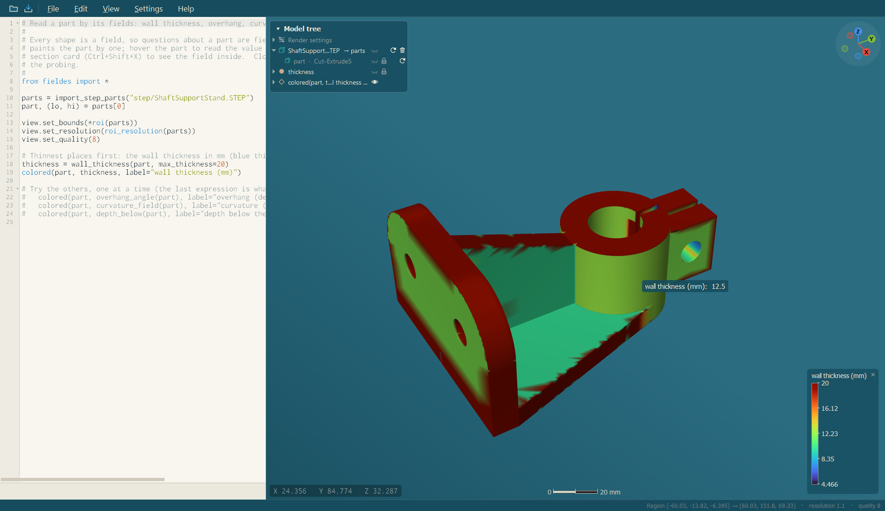

<p align="center">
  
</p>

# FielDes

**Field-driven design.** A scriptable design and analysis workbench in which every shape, every
analysis result and every design parameter is a *field* — a value at every point in space — so that
anything can drive anything: a stress field sets the density of a lattice, a regression over test data
sets a wall thickness, a temperature field thickens a fin.

FielDes models with implicit functions (signed distance fields), imports real CAD (STEP) by
rebuilding it as fields, runs finite-element analyses on the result, and keeps the script and the
viewport in step: every button in the viewport edits the script, and every edit of the script re-renders
the viewport.

<p align="center">
  
</p>

> **Status: first beta (0.1).** Windows 10/11 (x64) is the tested platform. See [Known limitations](#known-limitations).

## What it does

| | |
|---|---|
| **Model with fields** | Primitives, CSG, smooth and chamfered booleans, offsets, shells, twists, bends, repeats, extrusions, revolves, helical and free-form surfaces — all of them fields, composable with ordinary arithmetic. |
| **Import STEP** | Every solid is rebuilt from its faces as a field: planes, cylinders, cones, spheres and tori exactly, **free-form (B-spline) faces by fitted closed-form surfaces**, with the deviation from the CAD reported and painted on the model. Assemblies arrive assembled, each part in its own units. |
| **Parts that are all free-form** | `import_step_tessellated_parts()` fits nothing: every solid is tessellated straight from its faces (on all threads, kept next to the file) and the triangles are made the exact signed distance field — for gears, worms, threads and sculpted bodies the fitted surfaces do not follow. Meshing it takes 0.5 to 2.8 times as long as the main importer's formulas. |
| **Exact where it matters** | `exclude()` (or `auto_exclude=True` on the import) puts the STEP file's *own* surface back wherever the fit is poor: inside the region (any field object) the surface is meshed straight from the B-rep. |
| **Edit by dragging** | A gizmo (move, rotate, scale), native handles on any surface of a shape or imported part, and `var()` numbers — what you drag is written back into the script. |
| **Analyse** | Static structural, modal, thermal and thermal-stress analysis on tetrahedral meshes that follow the part's surface; structural and thermal topology optimization; load cases; materials. |
| **Drive design with results** | `colored(part, field)`, `ramp(result.von_mises, …)`, `fit(data)(depth_below(part))` — results and data are fields that feed lattices, offsets and thicknesses. |
| **Lattices** | Nine TPMS families (sheet or network), a dozen strut lattices, planar patterns, Voronoi foams, surface and graph lattices, custom unit cells and equations, conformal cell maps (struts or a periodic surface that follows the part); any size or density can be a field. |
| **Inspect** | A section card that cuts the model and paints the field on the plane (distance, or an analysis result with its elements); wall thickness, overhang, curvature and depth fields; hover probing; legends. |
| **Bring meshes in** | STL, OBJ, PLY, 3MF and glTF as exact distance fields. |
| **Fast to work in** | Content-addressed caches (imports, exact distances, analyses, graphs), a render cache for the meshes you pick in the model tree, per-statement progress, breakpoints, go to definition into any library or module file (opened in a tab), hot reload of imported files, cancel for slow renders. |

## Quick start

1. Get the portable folder (a release zip, or build it yourself with `scripts/build-windows.ps1 -Package`, see
   [Building](docs/building.md)), unzip it anywhere and run `FielDes.exe`. Nothing is installed.
2. **File → Import model…** (`Ctrl+I`) and pick a STEP file — or open a script from `examples/`.
3. Click a row in the model tree, drag the gizmo, open the section card (`Ctrl+Shift+X`), hover the model.
4. `Shift+F1` opens the guide with every feature and shortcut; `F1` the shape reference.

The smallest script:

```python
from fieldes import *

view.set_bounds([-10, -10, -10], [10, 10, 10])   # the region the viewport meshes
view.set_resolution(10)                          # samples per mm
view.set_quality(8)

r = var(3)                                        # a draggable number
difference(sphere(r), cylinder_z(1.2, 12, (0, 0, -6)))
```

The last expression is what is shown; assign other shapes to names and they appear in the model tree.

## Examples

All of the examples start from imported STEP geometry in `examples/step/`. **The sample STEP files are not
included** (they are downloads from GrabCAD whose terms do not allow redistributing them): put your own
STEP files there under the names in [`examples/step/README.md`](examples/step/README.md), or change the path
in a script. The first import of a file takes a few seconds and is cached next to it.

| Example | Shows |
|---|---|
| [`01_import_a_part.py`](examples/01_import_a_part.py) | Importing, the view settings, mass properties |
| [`02_inspect_a_part.py`](examples/02_inspect_a_part.py) | Wall thickness, overhang, curvature and depth fields; probing; sections |
| [`03_kitchen_assembly.py`](examples/03_kitchen_assembly.py) | A 90-part assembly with free-form surfaces; fit deviation; `exclude()` with a field object as the region, on the whole import |
| [`04_handles.py`](examples/04_handles.py) | The gizmo, handles and lock modes |
| [`05_static_analysis.py`](examples/05_static_analysis.py) | Static FEA: supports, loads, results card |
| [`06_modal_analysis.py`](examples/06_modal_analysis.py) | Natural frequencies and mode shapes |
| [`07_thermal_analysis.py`](examples/07_thermal_analysis.py) | Conduction and convection |
| [`08_topology_optimization.py`](examples/08_topology_optimization.py) | The stiffest part in 45 % of the material |
| [`09_lattice.py`](examples/09_lattice.py) | A gyroid graded by a regression over depth |
| [`10_field_driven_design.py`](examples/10_field_driven_design.py) | Stress field → lattice density |
| [`11_custom_lattice.py`](examples/11_custom_lattice.py) | Your own strut cell and TPMS equation |
| [`12_mesh_export_and_import.py`](examples/12_mesh_export_and_import.py) | STL out and back in |
| [`13_tessellated_import.py`](examples/13_tessellated_import.py) | The kitchen imported exactly, nothing fitted |
| [`14_conformal_lattice.py`](examples/14_conformal_lattice.py) | A lattice of a cell of your own (`cell_custom`) that follows an open surface |
| [`15_conformal_closed_body.py`](examples/15_conformal_closed_body.py) | A conformal strut lattice filling the wall of a whole bracket: faces, fillets, bores, edges followed |

<p align="center">
  
</p>

`python scripts/run_example.py examples/05_static_analysis.py` runs any script without the application.

## Documentation

| | |
|---|---|
| [Getting started](docs/getting-started.md) | Install, first script, a tour of the window |
| [The interface](docs/interface.md) | Top bar, editor, viewport, model tree, section card, result card, shortcuts |
| [Scripting](docs/scripting.md) | Shapes, fields, `var()`, view settings, what gets displayed |
| [Importing STEP files](docs/step-import.md) | Reconstruction, B-spline fits, `exclude()`, `auto_exclude`, the tessellated importer, assemblies, units, caches |
| [Handles](docs/handles.md) | Gizmo, native handles, `expose()`, reimport |
| [Fields and regressions](docs/fields.md) | Distance fields, maps, `fit()`, analysis fields, coloring |
| [Analysis](docs/analysis.md) | Static, modal, thermal, thermal stress, topology optimization; seeing the boundary conditions |
| [Selecting surfaces](docs/selecting-surfaces.md) | Right-click a face: a flood-filled surface as a field, for supports, loads and lattices |
| [Lattices](docs/lattices.md) | Every lattice type and parameter |
| [Meshes](docs/meshes.md) | Mesh import, STL export |
| [Caching and performance](docs/caching-and-performance.md) | What is cached, resolution and quality, long renders |
| [Troubleshooting](docs/troubleshooting.md) | Empty viewport, slow renders, import and analysis errors |
| [Library reference](docs/reference.md) | Every function and class, from its docstring |
| [Architecture](docs/architecture.md) | How the kernel, the Python library and the application fit together |
| [Building from source](docs/building.md) | Windows build with MSVC and vcpkg; making the portable folder |

## Known limitations

- **Free-form faces are fitted, not exact, in the field.** The importer rebuilds B-spline faces as
  closed-form surfaces (planes, quadrics, extrusions, revolutions, helices, fillets); where that is poor
  the import says so and colours it, and `exclude()` / `auto_exclude` draw the real surface there. The
  field itself — what analysis and lattices see — stays the fitted one.
- **Tori are not refined in the exact mesh:** a large torus face can come out a few percent small in the
  `exclude()` / `auto_exclude` surface (up to −8 % volume on the worst test part). The field has tori exact.
- Linux and macOS are not tested; the build files are CMake and the code is portable Qt/C++, but the
  application has only been built and used on Windows.
- Units: STEP units are read and converted; STL/OBJ/PLY carry none and are assumed to be millimetres
  (`file_units=`).
- Analyses are linear (small strain, linear material) and use tetrahedra (or voxel hexahedra); no contact.

## Project layout

```
kernel/       the C++ kernel: field evaluation, meshing, STEP import, analysis  (fieldes.dll)
python/       the Python library  (import fieldes)
app/          the Qt application  (FielDes.exe)
examples/     example scripts and the STEP files they import
docs/         documentation
scripts/      build script, headless runner, reference generator
```

## Credits and licence

FielDes was created by its author ([Tinomart](https://github.com/Tinomart)) **with the help of Claude Code**
(Anthropic's AI coding assistant): the author set the direction and the design, tested the result and decided what
stays; much of the code was written together with Claude Code.

FielDes stands on **libfive** by Matt Keeter ([github.com/libfive/libfive](https://github.com/libfive/libfive)):
its kernel (`kernel/`, namespace `libfive`) and Python bindings (`python/`) are under the
**Mozilla Public License 2.0** (`LICENSE-MPL-2.0`), and the application (`app/`) derives from its
**Studio** GUI and is under the **GNU General Public License, version 2 or later** (`LICENSE-GPL-2.0`).
Files added for FielDes carry the licence of the part they belong to. See [`NOTICE.md`](NOTICE.md) for the
list of third-party components (Qt, Eigen, Boost, Manifold, libpng, Python, the Inconsolata font).
