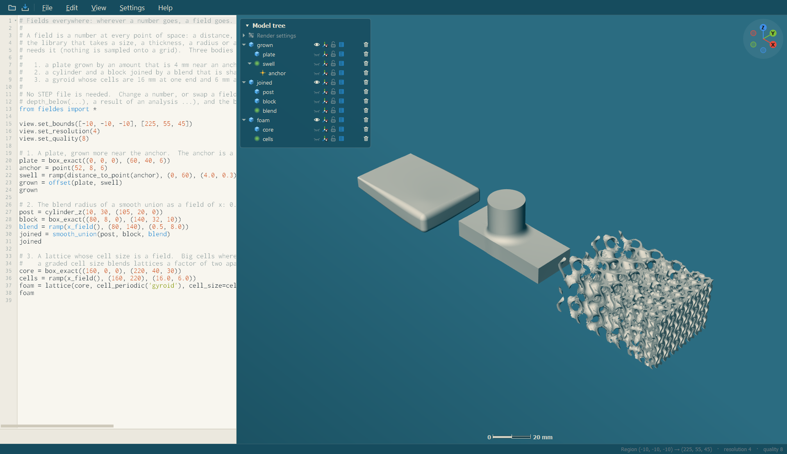
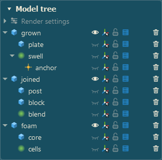
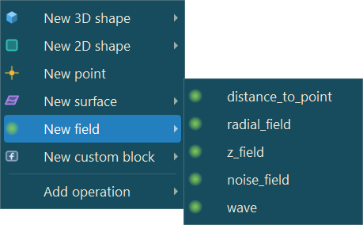
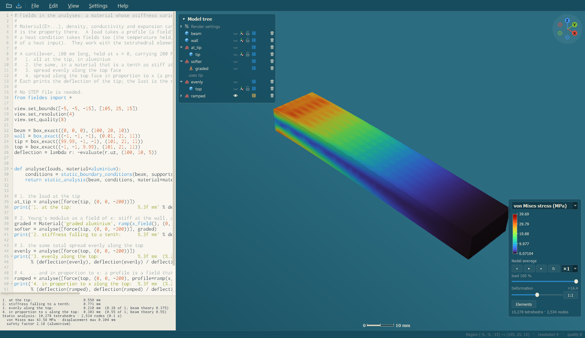

<p align="center">
  
</p>

# FielDes

**Field-driven design.** A scriptable design and analysis workbench in which every shape, every
analysis result and every design parameter is a *field* — a value at every point in space — so that
**anything can drive anything**: a stress field sets the density of a lattice, a regression over test data
sets a wall thickness, a temperature field thickens a fin, a point you drag moves a whole swelling of a plate.

Wherever a number goes in FielDes, **a field goes**: `offset(part, 1.0)` grows a part by a millimetre everywhere;
`offset(part, ramp(distance_to_point(anchor), (0, 60), (4.0, 0.3)))` grows it by 4 mm near the anchor and 0.3 mm far from
it. The two are written alike, and the field is evaluated exactly where it is needed — never sampled onto a grid.

FielDes models with implicit functions (signed distance fields), imports real CAD (STEP) by
rebuilding it as fields, runs finite-element analyses on the result, and keeps the script and the
viewport in step: every button in the viewport edits the script, and every edit of the script re-renders
the viewport.

<p align="center">
  
</p>

## The idea

- **The script is the model.** What you see is what a Python script says. Every drag and every button in the viewport is an
  edit of that script — readable, undoable, shareable.
- **Everything is a field.** Shapes, distances, ramps, noise, temperatures, the stress of an analysis: numbers at every point,
  combined with ordinary arithmetic. Any of them can stand where a number stands.
- **Direct manipulation, written down.** Pull a surface or a gizmo: the numbers in the script change. Edit a number: the
  viewport follows.
- **Your own building blocks.** A function in a file of the blocks folder is there in every script, with completion, call
  tips and a place in the menus.

New here? FielDes offers a **guided tour** the first time it starts (**Help → Guided tour** any time after): short cards over the
program itself that point at what they talk about and let you try it. The [tutorial](docs/tutorial.md) is the written version.

## What it does

| | |
|---|---|
| **Fields everywhere** | Every size, radius, thickness, spacing and blend of every function takes a field instead of a number; so do the properties and loads of an analysis (`Material(E=field)`, `force(..., profile=field)`, a convection coefficient). Lattices have a graded cell size. [How it works](docs/fields.md#fields-everywhere) |
| **A typed, nested model tree** | Every kind of thing — 3D shape, 2D shape, field, surface, point, simulation, material, conditions, lattice cell — has its own colour and icon. The models an operation is made of are its children, **and nesting always edits the call**: drag a row onto an operation to make it an input, out of one to take it out, between its children to reorder them; a model used twice has a half-transparent **shadow** row at its other use; `Ctrl`+drag adds a reference without moving the model. [The tree](docs/interface.md#the-model-tree) |
| **Make things from the context menu** | Right-click: *Import model...*, *New 3D shape / 2D shape / point / surface / field*, *Add operation* and *Add simulation* (which holds *New material / fluid / support or load / thermal condition / flow condition* — materials and conditions are models of their own kind: drag one -- or several, selected together -- onto an analysis and they go in the input of their kind: `material=`, `supports=`, `inlets=` ... — then the analyses of a model) — each writes script where you clicked. *low_level_field* and *low_level_body* write a function of x, y and z for you to put your own logic in. On a model it offers *Operation* (offsets, moving, **field math**, ...) and *Simulation* (static, modal, topology optimization, thermal, flow, each with a placeholder for every kind of boundary condition it takes; and the materials and conditions to make), written with that model as an argument. The same menu opens on a **line of the script** and on a **row of the model tree**. |
| **Fields you can see** | A field is not a body, so it is not drawn: select it in the model tree and the field viewer opens on it: a disc, centred where the field is about, coloured by its value at every point (move, resize and turn it; a menu chooses among several selected fields). Arithmetic works on fields as it does on numbers (`a * b`, `2 ** a`, ...), and `field_from_body(body)` turns a body into a field you may multiply freely. |
| **Custom blocks** | A few lines in a file of the blocks folder make a function that is in every script — completion, call tips, menu entries, hot reload. [Custom blocks](docs/blocks.md) |
| **Model with fields** | Primitives, CSG, smooth and chamfered booleans, offsets, shells, twists, bends, repeats, extrusions, revolves, helical and free-form surfaces — all of them fields, composable with ordinary arithmetic. |
| **Import a model** | `import_model()` reads a STEP file or a mesh and chooses for each part: a part mostly of planes and cylinders is **reconstructed**, a part with more than a tenth of its surface free-form (or a surface body) is **tessellated** (see below). Reconstructed, every solid is rebuilt from its faces as a field: planes, cylinders, cones, spheres and tori exactly, **free-form (B-spline) faces by fitted closed-form surfaces**, with the deviation from the CAD reported and painted on the model. Assemblies arrive assembled, each part in its own units. |
| **Parts that are all free-form** | `tessellate()` fits nothing: every solid is tessellated straight from its faces (on all threads, kept next to the file) and the triangles are made the exact signed distance field — for gears, worms, threads and sculpted bodies the fitted surfaces do not follow. Meshing it takes 0.5 to 2.8 times as long as the main importer's formulas. |
| **Exact where it matters** | `exclude()` (or `auto_exclude=True` on the import) locks a region of a shape against everything done to it afterwards; for a STEP part the locked field is the file's *own* surface, meshed straight from the B-rep and made a field, wherever the fit is poor. It works on every shape and every field. |
| **Edit by dragging** | A gizmo (move, rotate, scale), native handles on any surface of a shape or imported part, and `var()` numbers — what you drag is written back into the script. |
| **Analyse** | Static structural, modal, thermal and thermal-stress analysis on tetrahedral meshes that follow the part's surface; structural and thermal topology optimization; load cases; materials that vary through the part. **Fluid flow**: laminar flow through or around any shape, steady or in time (inlets, outlets, moving walls, symmetry planes), with the velocity field, the pressure, the wake, flows and wall forces as results, shown with streamlines and moving particles; flow topology optimization (a body in the stream reshaped for the least drag or the most lift under a volume bound). Every result is stated like a shape to show it, and the result card steps through it: the load, a mode's vibration, the flow in time, the iterations of an optimization. |
| **Drive design with results** | `colored(part, field)`, `ramp(result.von_mises, …)`, `fit(data)(depth_below(part))` — results and data are fields that feed lattices, offsets and thicknesses. |
| **Lattices** | Nine TPMS families (sheet or network), a dozen strut lattices, planar patterns, Voronoi foams, surface and graph lattices, custom unit cells and equations, conformal cell maps (struts or a periodic surface that follows the part); any size, thickness or density — and the cell size — can be a field. |
| **Inspect** | A section card that cuts the model and paints the field on the plane (distance, or an analysis result with its elements); wall thickness, overhang, curvature and depth fields; hover probing; legends. |
| **Bring meshes in** | STL, OBJ, PLY, 3MF and glTF as exact distance fields (`import_model()` reads them like a STEP file). A **surface model** (open shells, as a CAD program exports a skin or a shoe) imports too: each shell a part, a sheet when it does not close. |
| **Fast to work in** | Content-addressed caches (imports, exact distances, analyses, graphs), a render cache for the meshes you pick in the model tree, per-statement progress, breakpoints, go to definition into any library or module file (opened in a tab), hot reload of imported files and blocks, cancel for slow renders. |

## Quick start

1. On Windows, run the **installer** of the release (`FielDes-<version>-windows-x64-setup.exe`: it asks for the language, installs for your user without administrator
   rights and makes the Start menu shortcut), **or** get the portable folder (the release zip, or build it yourself with `scripts/build-windows.ps1 -Package`, see
   [Building](docs/building.md)), unzip it anywhere and run `FielDes.exe`: nothing is installed. FielDes speaks English, Spanish, French, German, Japanese, Chinese
   and Russian (the language of Windows by default; **Settings → Language**).
2. The **guided tour** (it opens by itself the first time; later **Help → Guided tour**) walks through the basics; **File → Import model…** (`Ctrl+I`) brings in a STEP
   file; or open a script from `examples/` (01, 05, 08, 10 and 15 use the bracket that comes with FielDes; 14 and 16–21 need no
   STEP file).
3. Right-click empty space to make a shape; click a row in the model tree and drag the gizmo; open the section card
   (`Ctrl+Shift+X`); hover the model.
4. `Shift+F1` opens the guide with every feature and shortcut; `F1` the shape reference.

The smallest script:

```python
from fieldes import *

view.set_bounds([-35, -25, -8], [35, 25, 30])    # the region the viewport meshes
view.set_resolution(6)                           # samples per mm
view.set_quality(8)

plate   = box_exact((-30, -20, 0), (30, 20, var(6)))        # var(...): a number you can drag in the viewport
anchor  = point(20, 10, 6)                                    # a point is a model, and a value where a coordinate goes
swell   = ramp(distance_to_point(anchor), (0, 45), (3.0, 0.5))   # 3 mm at the anchor, 0.5 mm 45 mm away: a field
offset(plate, swell)                                          # a field where a number goes
```

The last expression is what is shown; assign other shapes to names and they appear in the model tree.

<p align="center">
  
  &nbsp;&nbsp;&nbsp;
  
</p>

## Examples

Examples 01–13 and 15 start from imported STEP geometry in `examples/step/`. **One sample part comes with FielDes**,
the pivot-bearing support bracket (`PivotBearingSupportBracket.STEP`, a GrabCAD download distributed at the
maintainer's decision, see [NOTICE.md](NOTICE.md)): examples 01, 05, 08, 10 and 15 run as they are. **The other
sample STEP files are not included**: put your own STEP files there under the names in
[`examples/step/README.md`](examples/step/README.md), or change the path in a script. The first import of a file
takes a few seconds and is cached next to it. **Examples 14 and 16–21 need no STEP file.**

| Example | Shows |
|---|---|
| [`01_import_a_part.py`](examples/01_import_a_part.py) | Importing, the view settings, mass properties |
| [`02_inspect_a_part.py`](examples/02_inspect_a_part.py) | Wall thickness, overhang, curvature and depth fields; probing; sections |
| [`03_kitchen_assembly.py`](examples/03_kitchen_assembly.py) | A 90-part assembly with free-form surfaces; fit deviation; `exclude()` with a field object as the region, on the whole import |
| [`04_handles.py`](examples/04_handles.py) | The gizmo (its click / never / always modes), dragging surfaces, and the lock |
| [`05_static_analysis.py`](examples/05_static_analysis.py) | Static FEA: supports, loads, results card |
| [`06_modal_analysis.py`](examples/06_modal_analysis.py) | Natural frequencies and mode shapes |
| [`07_thermal_analysis.py`](examples/07_thermal_analysis.py) | Conduction and convection |
| [`08_topology_optimization.py`](examples/08_topology_optimization.py) | The stiffest part in 50 % of the material, with the lug holes excluded so that they stay |
| [`09_lattice.py`](examples/09_lattice.py) | A gyroid graded by a regression over depth |
| [`10_field_driven_design.py`](examples/10_field_driven_design.py) | Stress field → lattice density |
| [`11_custom_lattice.py`](examples/11_custom_lattice.py) | Your own strut cell and TPMS equation |
| [`12_mesh_export_and_import.py`](examples/12_mesh_export_and_import.py) | STL out and back in |
| [`13_tessellated_import.py`](examples/13_tessellated_import.py) | The kitchen imported exactly, nothing fitted |
| [`14_conformal_lattice.py`](examples/14_conformal_lattice.py) | A lattice of a cell of your own (`cell_custom_truss`) that follows an open surface |
| [`15_conformal_closed_body.py`](examples/15_conformal_closed_body.py) | A conformal strut lattice filling the wall of a whole bracket: faces, fillets, bores, edges followed |
| [`16_fluid_flow.py`](examples/16_fluid_flow.py) | Water past a round post in a channel: the velocity field and the wake, streamlines with moving particles, the drag; the flow in time as an option |
| [`17_flow_topology_optimization.py`](examples/17_flow_topology_optimization.py) | The channel through a block with the least pressure drop |
| [`18_fields_everywhere.py`](examples/18_fields_everywhere.py) | A plate grown by a field, a blend whose radius varies, a lattice of graded cell size — driven from a point |
| [`19_graded_material.py`](examples/19_graded_material.py) | A material whose stiffness varies and a load spread by a profile, against beam theory |
| [`20_custom_blocks.py`](examples/20_custom_blocks.py) | Your own blocks: `perforate` with a field radius, `bracket` |
| [`21_low_level.py`](examples/21_low_level.py) | Low-level fields, as in libfive's Scheme `define-shape` / `remap-shape`: a cube from six plane distances, a twist by a remap, a ball and a torus from their formulas, a gyroid |

<p align="center">
  
</p>

`python scripts/run_example.py examples/05_static_analysis.py` runs any script without the application.

## Documentation

| | |
|---|---|
| [Tutorial](docs/tutorial.md) | The idea, the window, the controls that matter, in a short walk |
| [Getting started](docs/getting-started.md) | Install, first script, a tour of the window |
| [The interface](docs/interface.md) | Top bar, editor, viewport, the typed and nested model tree, drag and drop, section card, result card, shortcuts |
| [Scripting](docs/scripting.md) | Shapes, fields, `var()`, view settings, what gets displayed |
| [Fields and regressions](docs/fields.md) | **Fields everywhere**, points and surfaces, distance fields, maps, `fit()`, coloring |
| [Custom blocks](docs/blocks.md) | Your own functions, in every script |
| [Importing STEP files](docs/step-import.md) | Reconstruction, B-spline fits, `exclude()`, `auto_exclude`, the tessellated importer, assemblies, units, caches |
| [Handles](docs/handles.md) | Gizmo, native handles, `expose()`, reimport |
| [Analysis](docs/analysis.md) | Static, modal, thermal, thermal stress, topology optimization, fields in analyses; seeing the boundary conditions |
| [Selecting surfaces](docs/selecting-surfaces.md) | Right-click a face: a flood-filled surface as a field, for supports, loads and lattices |
| [Lattices](docs/lattices.md) | Every lattice type and parameter |
| [Meshes](docs/meshes.md) | Mesh import, STL export |
| [Caching and performance](docs/caching-and-performance.md) | What is cached, resolution and quality, long renders |
| [Troubleshooting](docs/troubleshooting.md) | Empty viewport, slow renders, import and analysis errors |
| [Library reference](docs/reference.md) | Every function and class, from its docstring |
| [Architecture](docs/architecture.md) | How the kernel, the Python library and the application fit together |
| [Building from source](docs/building.md) | Windows build with MSVC and vcpkg; making the portable folder |

## Known limitations

- **Free-form faces are fitted, not exact, in the field.** The importer rebuilds B-spline faces as
  closed-form surfaces (planes, quadrics, extrusions, revolutions, helices, fillets); where that is poor
  the import says so and colours it, and `exclude()` / `auto_exclude` put the real surface there as a locked
  field (made from a mesh of the STEP file). Outside the region the field stays the fitted one.
- **Tori are not refined in the exact mesh:** a large torus face can come out a few percent small in the
  `exclude()` / `auto_exclude` surface (up to −8 % volume on the worst test part). The field has tori exact.
- **An excluded STEP part's locked field is a mesh's distance**, made when the script runs (the tessellation of the
  part, once; kept while the script is run again). Dragging a `var()` that its region or placement uses updates it
  when the drag ends.
- **Fields as material properties and loads work with the tetrahedral elements**; the voxel elements and the flow solver take
  numbers (they say so when given a field). A graded lattice cell size changes by at most a factor of 16 over the part.
- Windows is the main platform. **Linux** builds with `scripts/build-linux.sh` (see [Building](docs/building.md); made
  and tried under WSL2 + WSLg on Fedora); macOS has not been tried.
- Units: STEP units are read and converted; STL/OBJ/PLY carry none and are assumed to be millimetres
  (`file_units=`).
- Analyses are linear (small strain, linear material) and use tetrahedra (or voxel hexahedra); no contact.

## Project layout

```
kernel/       the C++ kernel: field evaluation, meshing, STEP import, analysis  (fieldes.dll)
python/       the Python library  (import fieldes)
app/          the Qt application  (FielDes.exe)
blocks/       the custom blocks folder: sample blocks, and where yours go
examples/     example scripts and the STEP files they import
docs/         documentation
scripts/      build script, headless runner, reference generator
```

## Credits and licence

FielDes was created by its author ([Tinomart](https://github.com/Tinomart)) **with the help of Claude Code**
(Anthropic's AI coding assistant): the author set the direction and the design, tested the result and decided what
stays; much of the code was written together with Claude Code.

FielDes stands on **libfive** by Matt Keeter ([github.com/libfive/libfive](https://github.com/libfive/libfive)):
its kernel (`kernel/`, namespace `libfive`) and Python bindings (`python/`) are under the
**Mozilla Public License 2.0** (`LICENSE-MPL-2.0`), and the application (`app/`) derives from its
**Studio** GUI and is under the **GNU General Public License, version 2 or later** (`LICENSE-GPL-2.0`).
Files added for FielDes carry the licence of the part they belong to. See [`NOTICE.md`](NOTICE.md) for the
list of third-party components (Qt, Eigen, Boost, Manifold, libpng, Python, the Inconsolata font).
